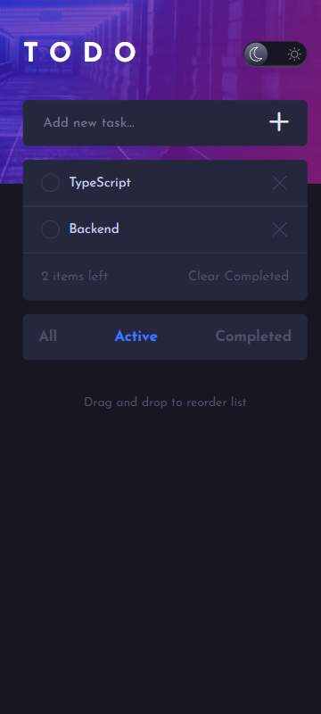
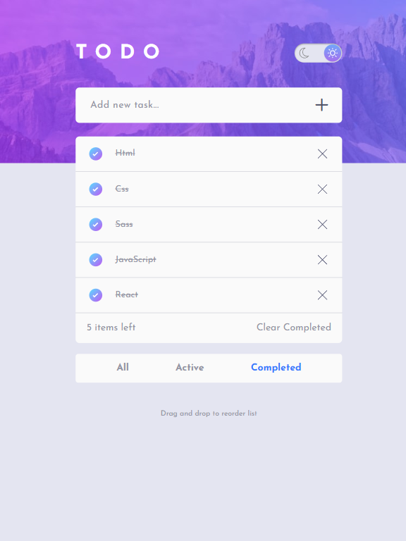
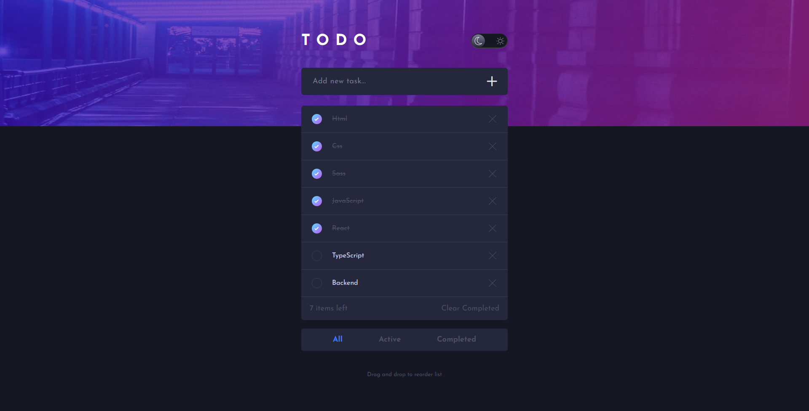

# ✅ TodoApp

Zaawansowana aplikacja typu ToDo do zarządzania zadaniami, umożliwiająca dodawanie, filtrowanie, przeciąganie i organizowanie zadań. Projekt stworzony w czystym JavaScript, HTML i SCSS – z myślą o rozwijaniu umiejętności frontendowych i pracy z danymi lokalnymi.


## 🔗 Demo

👉 [Zobacz na żywo](https://dawidkuczma-dev.github.io/ToDoApp/)

## 📸 Zrzuty ekranu

<p align="center">
  
  
  
</p>


## ⚙️ Technologie

- HTML5
- SCSS (Sass)
- JavaScript (Vanilla)
- LocalStorage (do trwałego zapisu zadań w przeglądarce)

## 📁 Struktura folderów

```bash
📁 ToDoApp
├── 📁 assets
│   └── 📁 images
│       ├── bg-desktop-dark.png
│       ├── bg-desktop-light.png
│       └── ...
├── 📁 css
│   └── main.css
├── 📁 js
│   └── script.js
├── 📁 scss
│   ├── _base.scss
│   ├── _footer.scss
│   └── ...
├── index.html
└── README.md

📁 assets/images – zawiera zrzuty ekranu, tła i ikony  
📁 js – skrypty odpowiedzialne za motyw, obsługę tasków oraz localStorage  
📁 scss – pliki źródłowe stylów (moduły SCSS)  
📁 css – skompilowany plik stylów dla strony

```

## 📦 Funkcje

- ➕ Dodawanie nowych zadań
- ✅ Oznaczanie zadań jako ukończone
- 🖱️ Przeciąganie i zmiana kolejności zadań (Drag & Drop)
- 🔄 Filtrowanie zadań:
  - Wszystkie
  - Aktywne
  - Ukończone
- 🗑️ Usuwanie zadań
- 🧹 Przycisk do usuwania wszystkich ukończonych zadań
- 💾 Zapisywanie zadań w LocalStorage
- 🌓 Tryb ciemny i jasny (Dark/Light Mode)
- 📱 Responsywny wygląd (mobile & desktop)

## 🧠 Czego się nauczyłem

- Zaawansowana praca z DOM w czystym JS
- Implementacja drag-and-drop bez bibliotek
- Obsługa LocalStorage do przechowywania danych
- Tworzenie dynamicznych elementów na stronie
- Obsługa trybu ciemnego i jasnego (z zachowaniem preferencji użytkownika)
- Budowanie filtrowanych widoków

## 🚀 Uruchomienie lokalne

1. Sklonuj repozytorium  
```bash
git clone https://github.com/DawidKuczma-dev/ToDoApp.git
```
2. Otwórz plik `index.html` w przeglądarce lub uruchom lokalny serwer (np. Live Server)

## 📇 Autor

Dawid Kuczma  
[LinkedIn](https://www.linkedin.com/in/dawid-kuczma-a60836369/) • [GitHub](https://github.com/DawidKuczma-dev)

## 📝 Licencja

Ten projekt jest dostępny na zasadach licencji MIT.


